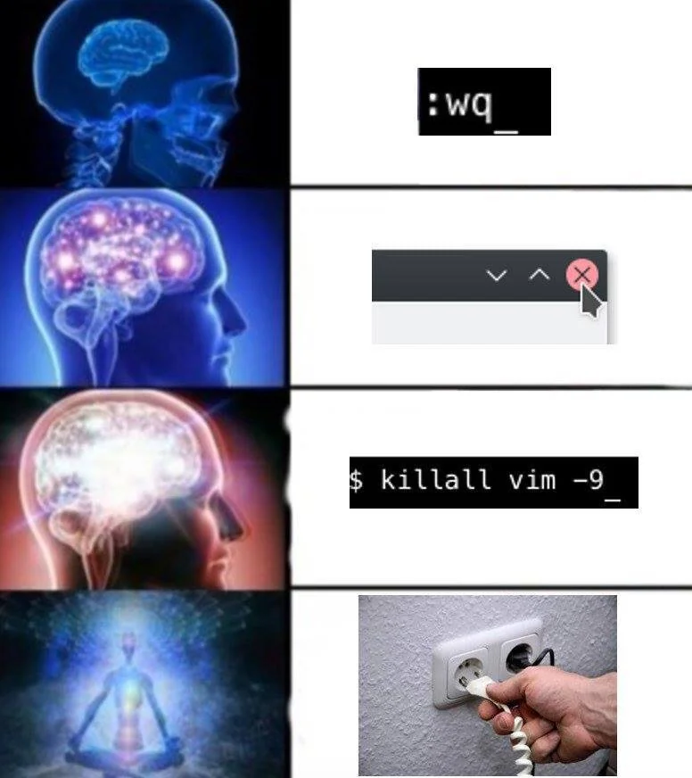
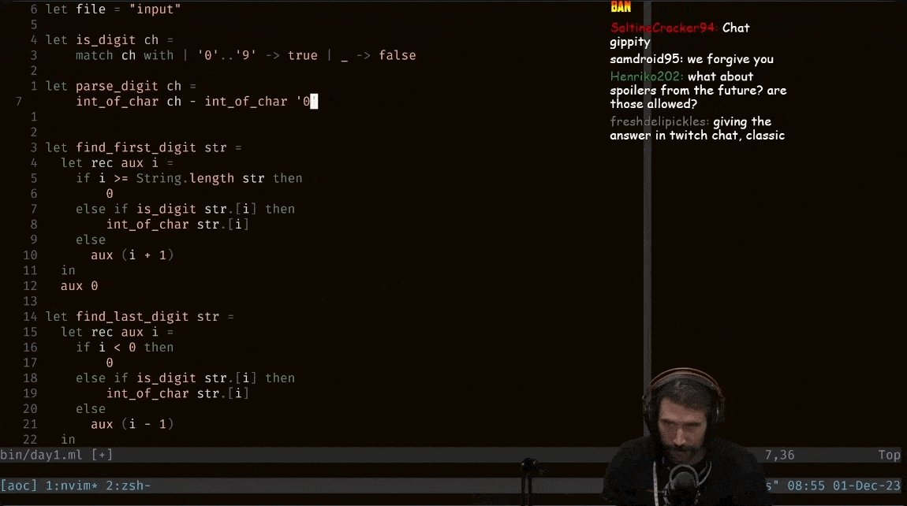

+++
title = 'How vim helped me code faster'
date = 2024-07-14T13:14:53-03:00
draft = false
type = 'post'
showTableOfContents = true
tags = ['vim', 'neovim', 'coding', 'productivity', 'setup']
+++

## Coding in my early days

Ever since I started coding, I've always been looking for ways to improve my workflow. I've tried many different editors and IDEs, but I never really found one that I was completely satisfied with.
That is until I discovered vim.

Not only is vim extremely powerful and customizable, but it also has a very active community that is constantly creating new plugins and tools to make coding even faster and more efficient.

## How I got started with vim

It all started when I was working on a project with a raspberry pi that one of my dear cousins gave me as a gift for my 16th birthday. I had to edit some configuration files following a tutorial I found online,
back then I didn't know much about computers, so I was just following the steps without really understanding what I was doing. That is until I stumbled upon vim. At first, as every vim beginner, I didn't know how
to save or exit the editor, so I just ended up unplugging the raspberry pi and starting over.

I felt so defeated by this editor that I decided to never use it again.

<figure>
     
    <center>
        <figcaption>first-timer vim experience</figcaption>
    </center>
</figure>

## Discovering ThePrimeagen

Fast forward to 2022, I was watching some youtube videos about coding and I found this guy called ThePrimeagen. He was talking about some programming stuff and then he started talking about vim. I was astonished by
how fast he could navigate through files and how he could do everything without ever touching the mouse that I thought it was all staged. I was on summer break from university, so I decided to give vim another try.

<figure>
     
    <center>
        <figcaption>ThePrimeagen coding</figcaption>
    </center>
</figure>

However ThePrimeagen's vim looked a bit strange for me, It has a LSP, syntax highlighting, and a lot of other stuff that mine didn't have. So I started looking for some tutorials on how to customize vim and I found out
about neovim.

## Neovim

Neovim is a fork of vim that is focused on extensibility and usability. It has a lot of new features that make it easier to customize and extend, such as built-in LSP support, tree-sitter syntax highlighting and
a bunch of other stuff that you can extend with plugins.

The main difference between vim and neovim is that vim uses vimscript, a language that is not very friendly to new users, while neovim uses lua, a language that is much easier to learn and use.

## Setting up neovim

This setup is based on my personal preferences and workflow, so feel free to customize it to fit your needs.

### 1. Installation

For this setup, I used a package manager called [ homebrew ](https://brew.sh/), but you can use any package manager you want or check the [ official neovim page ](https://neovim.io/) for installation instructions.

```bash
brew install neovim
```

#### 1.1 Remove old configuration (OPTIONAL)

If you're coming from vim or have an old neovim configuration, you might want to remove it before setting up this new one:

```bash
rm ~/.config/nvim/
```

Alternatively, you can just backup your old configuration and move it to another folder:

```bash
mv ~/.config/nvim/ ~/.config/nvim.bak
```

Remove plugins cache:

```bash
rm ~/.local/share/nvim
```

### 2. Configuration

Navigate to your nvim configuration in **~/.config/nvim/** the configuration structure is as follows:

```bash
├── lua
│   └── ignacioillanes
│       ├── core
│       │   ├── init.lua
│       │   ├── keymaps.lua
│       │   └── options.lua
│       ├── plugins
│       │   ├── init.lua
│       └── lazy.lua
└── init.lua
```

Go ahead and create the folders and files if they don't exist.

Now navigate to the **init.lua** at the root of the configuration and paste the following code:

```lua
require("ignacioillanes.core")
require("ignacioillanes.lazy")
```

Go to **lua/ignacioillanes/core/init.lua** and paste the following code:

```lua
require("ignacioillanes.core.options")
require("ignacioillanes.core.keymaps")
```

#### Lazy.nvim installation

We're going to use [ lazy.nvim ](https://lazy.folke.io/) to load the plugins only when we need them, so go to **lua/ignacioillanes/lazy.lua** and paste the following code:

```lua
-- Bootstrap lazy.nvim
local lazypath = vim.fn.stdpath("data") .. "/lazy/lazy.nvim"
if not (vim.uv or vim.loop).fs_stat(lazypath) then
  local lazyrepo = "https://github.com/folke/lazy.nvim.git"
  vim.fn.system({ "git", "clone", "--filter=blob:none", "--branch=stable", lazyrepo, lazypath })
end
vim.opt.rtp:prepend(lazypath)

-- Load lazy.nvim
require("lazy").setup({ { import = "ignacioillanes.plugins" }, { import = "ignacioillanes.plugins.lsp" } }, {
  checker = {
    enabled = true,
    notify = false,
  },
  change_detection = {
    notify = false,
  },
})
```

This will install lazy.nvim if it's not already installed and load the plugins when you need them.

#### Core configuration

Now go to **lua/ignacioillanes/core/options.lua** and paste the following code:

##### Options

```lua
local opt = vim.opt

opt.relativenumber = true
opt.number = true

-- tabs and indentation
opt.tabstop = 2
opt.shiftwidth = 2
opt.expandtab = true
opt.autoindent = true
opt.smartindent = true

-- line wraping
opt.wrap = false

-- search settings
opt.ignorecase = true
opt.smartcase = true

opt.cursorline = true

-- appearance
opt.termguicolors = true
opt.background = "dark"
opt.signcolumn = "yes"

-- backspace
opt.backspace = "indent,eol,start"

--clipboard
opt.clipboard:append("unnamedplus")

-- split windows
opt.splitright = true
opt.splitbelow = true

-- On exit changes cursor from vertical bar to vertical line
vim.cmd([[
  augroup RestoreCursorShapeOnExit
    autocmd!
    autocmd VimLeave * set guicursor=a:ver25-iCursor
  augroup END
]])
```

This are some basic options that I like to have in my editor, feel free to customize them to fit your needs.

##### keymaps

Navigate to **lua/ignacioillanes/core/keymaps.lua** and paste the following code:

```lua
vim.g.mapleader = " "

local keymap = vim.keymap

-- general keymaps
-- remap ESC key
keymap.set("i", "tn", "<ESC>", { desc = "Exit insert mode with tn" })
keymap.set("v", "tn", "<ESC>", { desc = "Exit visual mode with tn" })

-- search highlights
keymap.set("n", "<leader>nh", ":nohl<CR>", { desc = "Clear search highlights" })

-- window management
keymap.set("n", "<leader>sv", "<C-w>v", { desc = "split window vertically" })
keymap.set("n", "<leader>sh", "<C-w>s", { desc = "split window horizontally" })
keymap.set("n", "<leader>se", "<C-w>=", { desc = "make split windows equal width & height" })
keymap.set("n", "<leader>sx", ":close<CR>", { desc = "close current split window" })

-- tab management
keymap.set("n", "<leader>to", "<cmd>tabnew<CR>", { desc = "Open new tab" })
keymap.set("n", "<leader>tx", "<cmd>tabclose<CR>", { desc = "Close current tab" })
keymap.set("n", "<leader>tn", "<cmd>tabn<CR>", { desc = "Go to next tab" })
keymap.set("n", "<leader>tp", "<cmd>tabp<CR>", { desc = "Go to previous tab" })
keymap.set("n", "<leader>tf", "<cmd>tabnew %<CR>", { desc = "Open current buffer in new tab" })
```

Here I'm setting some basic keymaps that I like to have in my editor, I'm also setting the leader key to the space bar, this is a personal preference, feel free to change it to whatever you like.

#### Plugins

Navigate to **lua/ignacioillanes/plugins/init.lua** and paste the following code:

```lua
return {
  "nvim-lua/plenary.nvim", -- lua functions that many plugins use
  "christoomey/vim-tmux-navigator", -- tmux & split wv svndow navigation
}
```

Here I'm loading some plugins that don't need any configuration, you can add more plugins here if you want.

> After many iterations, I've found that the best way to manage plugins is to create a separate file for each plugin, this way you can easily enable or disable them.

Now create a new file called **lua/ignacioillanes/plugins/colorscheme.lua** and paste the following code:

```lua
return {
  "bluz71/vim-moonfly-colors",
  priority = 1000,
  config = function()
    -- colorscheme configuration
    vim.g.moonflyTransparent = true
    vim.g.moonflyItalics = true
    vim.g.moonflyUndercurls = true
    vim.g.moonflyUnderlineMatchParen = true

    -- load colorscheme
    vim.cmd("colorscheme moonfly")
  end
}
```

This will load the moonfly colorscheme and set some configuration options

Create a new file called **lua/ignacioillanes/plugins/auto-session.lua** and paste the following code:

```lua
return {
  "rmagatti/auto-session",
  config = function ()
    local auto_session = require("auto-session")

    auto_session.setup({
      auto_restore_enabled = false,
      auto_session_suppress_dirs = {
        "~/",
        "~/workspace",
        "~/Downloads",
        "~/Documents",
        "~/Desktop",
      },
    })

    -- set keymaps
    local keymap = vim.keymap

    keymap.set("n", "<leader>sr", "<cmd>SessionRestore<CR>", { desc = "Restore session for cwd" })
    keymap.set("n", "<leader>ss", "<cmd>SessionSave<CR>", { desc = "Save session" })

  end
}
```

Create a new file called **lua/ignacioillanes/plugins/autopairs.lua** and paste the following code:

```lua
return {
  "windwp/nvim-autopairs",
  event = { "InsertEnter" },
  dependencies = {
    "hrsh7th/nvim-cmp",
  },
  config = function()
    -- import nvim-autopairs
    local autopairs = require("nvim-autopairs")

    -- configure autopairs
    autopairs.setup({
      check_ts = true, -- enable treesitter
      ts_config = {
        lua = { "string" }, -- don't add pairs in lua string treesitter nodes
        javascript = { "template_string" }, -- don't add pairs in javscript template_string treesitter nodes
        java = false, -- don't check treesitter on java
      },
    })

    -- import nvim-autopairs completion functionality
    local cmp_autopairs = require("nvim-autopairs.completion.cmp")

    -- import nvim-cmp plugin (completions plugin)
    local cmp = require("cmp")

    -- make autopairs and completion work together
    cmp.event:on("confirm_done", cmp_autopairs.on_confirm_done())
  end,
}
```

Create a new file called **lua/ignacioillanes/plugins/bufferline.lua** and paste the following code:

```lua
return {
  "akinsho/bufferline.nvim",
  dependencies = { "nvim-tree/nvim-web-devicons" },
  version = "*",
  opts = {
    options = {
      mode = "tabs",
      separator_style = "thin",
    }
  }
}
```

#### LSP
