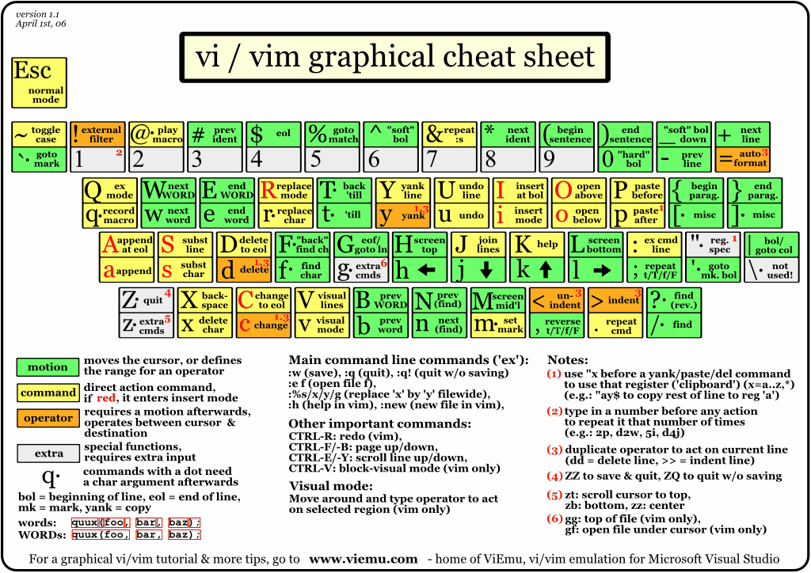

+++
title = 'How vim helped me code faster'
date = 2024-07-14T13:14:53-03:00
draft = false
type = 'post'
showTableOfContents = true
tags = ['vim', 'neovim', 'coding', 'productivity', 'setup']
+++

## Coding in my early days

Ever since I started coding, I've always been looking for ways to improve my workflow. I've tried many different editors and IDEs, but I never really found one that I was completely satisfied with.
That is until I discovered vim.

Not only is vim extremely powerful and customizable, but it also has a very active community that is constantly creating new plugins and tools to make coding even faster and more efficient.

## How I got started with vim

It all started when I was working on a project with a raspberry pi that one of my dear cousins gave me as a gift for my 16th birthday. I had to edit some configuration files following a tutorial I found online,
back then I didn't know much about computers, so I was just following the steps without really understanding what I was doing. That is until I stumbled upon vim. At first, as every vim beginner, I didn't know how
to save or exit the editor, so I just ended up unplugging the raspberry pi and starting over.

I felt so defeated by this editor that I decided to never use it again.

<figure>
     
    <center>
        <figcaption>first-timer vim experience</figcaption>
    </center>
</figure>

## Discovering ThePrimeagen

Fast forward to 2022, I was watching some youtube videos about coding and I found this guy called ThePrimeagen. He was talking about some programming stuff and then he started talking about vim. I was astonished by
how fast he could navigate through files and how he could do everything without ever touching the mouse that I thought it was all staged. I was on summer break from university, so I decided to give vim another try.

<figure>
     
    <center>
        <figcaption>ThePrimeagen coding</figcaption>
    </center>
</figure>

However ThePrimeagen's vim looked a bit strange for me, It has a LSP, syntax highlighting, and a lot of other stuff that mine didn't have. So I started looking for some tutorials on how to customize vim and I found out
about neovim.

## Neovim

Neovim is a fork of vim that is focused on extensibility and usability. It has a lot of new features that make it easier to customize and extend, such as built-in LSP support, tree-sitter syntax highlighting and
a bunch of other stuff that you can extend with plugins.

The main difference between vim and neovim is that vim uses vimscript, a language that is not very friendly to new users, while neovim uses lua, a language that is much easier to learn and use.

## Setting up neovim

This setup is based on my personal preferences and workflow, so feel free to customize it to fit your needs.

### 1. Installation

For this setup, I used a package manager called [ homebrew ](https://brew.sh/), but you can use any package manager you want or check the [ official neovim page ](https://neovim.io/) for installation instructions.

```bash
brew install neovim
```

#### 1.1. Remove old configuration (OPTIONAL)

If you're coming from vim or have an old neovim configuration, you might want to remove it before setting up this new one:

```bash
rm ~/.config/nvim/
```

Alternatively, you can just backup your old configuration and move it to another folder:

```bash
mv ~/.config/nvim/ ~/.config/nvim.bak
```

Remove plugins cache:

```bash
rm ~/.local/share/nvim
```

### 2. Configuration

Navigate to your nvim configuration in **~/.config/nvim/** the configuration structure is as follows:

```bash
├── lua
│   └── ignacioillanes
│       ├── core
│       │   ├── init.lua
│       │   ├── keymaps.lua
│       │   └── options.lua
│       ├── plugins
│       │   ├── init.lua
│       └── lazy.lua
└── init.lua
```

Go ahead and create the folders and files if they don't exist.

Now navigate to the **init.lua** at the root of the configuration and paste the following code:

```lua
require("ignacioillanes.core")
require("ignacioillanes.lazy")
```

Go to **lua/ignacioillanes/core/init.lua** and paste the following code:

```lua
require("ignacioillanes.core.options")
require("ignacioillanes.core.keymaps")
```

#### 2.1. Lazy.nvim installation

We're going to use [ lazy.nvim ](https://lazy.folke.io/) to load the plugins only when we need them, so go to **lua/ignacioillanes/lazy.lua** and paste the following code:

```lua
-- Bootstrap lazy.nvim
local lazypath = vim.fn.stdpath("data") .. "/lazy/lazy.nvim"
if not (vim.uv or vim.loop).fs_stat(lazypath) then
  local lazyrepo = "https://github.com/folke/lazy.nvim.git"
  vim.fn.system({ "git", "clone", "--filter=blob:none", "--branch=stable", lazyrepo, lazypath })
end
vim.opt.rtp:prepend(lazypath)

-- Load lazy.nvim
require("lazy").setup({ { import = "ignacioillanes.plugins" }, { import = "ignacioillanes.plugins.lsp" } }, {
  checker = {
    enabled = true,
    notify = false,
  },
  change_detection = {
    notify = false,
  },
})
```

This will install lazy.nvim if it's not already installed and load the plugins when you need them.

#### 2.2. Core configuration

Now go to **lua/ignacioillanes/core/options.lua** and paste the following code:

##### Options

```lua
local opt = vim.opt

opt.relativenumber = true
opt.number = true

-- tabs and indentation
opt.tabstop = 2
opt.shiftwidth = 2
opt.expandtab = true
opt.autoindent = true
opt.smartindent = true

-- line wraping
opt.wrap = false

-- search settings
opt.ignorecase = true
opt.smartcase = true

opt.cursorline = true

-- appearance
opt.termguicolors = true
opt.background = "dark"
opt.signcolumn = "yes"

-- backspace
opt.backspace = "indent,eol,start"

--clipboard
opt.clipboard:append("unnamedplus")

-- split windows
opt.splitright = true
opt.splitbelow = true

-- On exit changes cursor from vertical bar to vertical line
vim.cmd([[
  augroup RestoreCursorShapeOnExit
    autocmd!
    autocmd VimLeave * set guicursor=a:ver25-iCursor
  augroup END
]])
```

This are some basic options that I like to have in my editor, feel free to customize them to fit your needs.

##### keymaps

Navigate to **lua/ignacioillanes/core/keymaps.lua** and paste the following code:

```lua
vim.g.mapleader = " "

local keymap = vim.keymap

-- general keymaps
-- remap ESC key
keymap.set("i", "tn", "<ESC>", { desc = "Exit insert mode with tn" })
keymap.set("v", "tn", "<ESC>", { desc = "Exit visual mode with tn" })

-- search highlights
keymap.set("n", "<leader>nh", ":nohl<CR>", { desc = "Clear search highlights" })

-- window management
keymap.set("n", "<leader>sv", "<C-w>v", { desc = "split window vertically" })
keymap.set("n", "<leader>sh", "<C-w>s", { desc = "split window horizontally" })
keymap.set("n", "<leader>se", "<C-w>=", { desc = "make split windows equal width & height" })
keymap.set("n", "<leader>sx", ":close<CR>", { desc = "close current split window" })

-- tab management
keymap.set("n", "<leader>to", "<cmd>tabnew<CR>", { desc = "Open new tab" })
keymap.set("n", "<leader>tx", "<cmd>tabclose<CR>", { desc = "Close current tab" })
keymap.set("n", "<leader>tn", "<cmd>tabn<CR>", { desc = "Go to next tab" })
keymap.set("n", "<leader>tp", "<cmd>tabp<CR>", { desc = "Go to previous tab" })
keymap.set("n", "<leader>tf", "<cmd>tabnew %<CR>", { desc = "Open current buffer in new tab" })
```

Here I'm setting some basic keymaps that I like to have in my editor, I'm also setting the leader key to the space bar, this is a personal preference, feel free to change it to whatever you like.

#### 2.3. Plugins

Navigate to **lua/ignacioillanes/plugins/init.lua** and paste the following code:

```lua
return {
  "nvim-lua/plenary.nvim", -- lua functions that many plugins use
  "christoomey/vim-tmux-navigator", -- tmux & split wv svndow navigation
}
```

Here I'm loading some plugins that don't need any configuration, you can add more plugins here if you want.

> After many iterations, I've found that the best way to manage plugins is to create a separate file for each plugin, this way you can easily enable or disable them.

Now create a new file called **lua/ignacioillanes/plugins/colorscheme.lua** and paste the following code:

```lua
return {
  "bluz71/vim-moonfly-colors",
  priority = 1000,
  config = function()
    -- colorscheme configuration
    vim.g.moonflyTransparent = true
    vim.g.moonflyItalics = true
    vim.g.moonflyUndercurls = true
    vim.g.moonflyUnderlineMatchParen = true

    -- load colorscheme
    vim.cmd("colorscheme moonfly")
  end
}
```

This will load the moonfly colorscheme and set some configuration options

Create a new file called **lua/ignacioillanes/plugins/auto-session.lua** and paste the following code:

```lua
return {
  "rmagatti/auto-session",
  config = function ()
    local auto_session = require("auto-session")

    auto_session.setup({
      auto_restore_enabled = false,
      auto_session_suppress_dirs = {
        "~/",
        "~/workspace",
        "~/Downloads",
        "~/Documents",
        "~/Desktop",
      },
    })

    -- set keymaps
    local keymap = vim.keymap

    keymap.set("n", "<leader>sr", "<cmd>SessionRestore<CR>", { desc = "Restore session for cwd" })
    keymap.set("n", "<leader>ss", "<cmd>SessionSave<CR>", { desc = "Save session" })

  end
}
```

Create a new file called **lua/ignacioillanes/plugins/autopairs.lua** and paste the following code:

```lua
return {
  "windwp/nvim-autopairs",
  event = { "InsertEnter" },
  dependencies = {
    "hrsh7th/nvim-cmp",
  },
  config = function()
    -- import nvim-autopairs
    local autopairs = require("nvim-autopairs")

    -- configure autopairs
    autopairs.setup({
      check_ts = true, -- enable treesitter
      ts_config = {
        lua = { "string" }, -- don't add pairs in lua string treesitter nodes
        javascript = { "template_string" }, -- don't add pairs in javscript template_string treesitter nodes
        java = false, -- don't check treesitter on java
      },
    })

    -- import nvim-autopairs completion functionality
    local cmp_autopairs = require("nvim-autopairs.completion.cmp")

    -- import nvim-cmp plugin (completions plugin)
    local cmp = require("cmp")

    -- make autopairs and completion work together
    cmp.event:on("confirm_done", cmp_autopairs.on_confirm_done())
  end,
}
```

Create a new file called **lua/ignacioillanes/plugins/bufferline.lua** and paste the following code:

```lua
return {
  "akinsho/bufferline.nvim",
  dependencies = { "nvim-tree/nvim-web-devicons" },
  version = "*",
  opts = {
    options = {
      mode = "tabs",
      separator_style = "thin",
    }
  }
}
```

Create a new file called **lua/ignacioillanes/plugins/colorizer.lua** and paste the following code:

```lua
return {
	"norcalli/nvim-colorizer.lua",
	event = "BufRead",
	config = function()
		require("colorizer").setup()
	end,
}
```

Create a new file called **lua/ignacioillanes/plugins/comment.lua** and paste the following code:

```lua
return {
  "numToStr/Comment.nvim",
  event = { "BufReadPre", "BufNewFile" },
  dependencies = {
    "JoosepAlviste/nvim-ts-context-commentstring",
  },
  config = function()
    -- import comment plugin safely
    local comment = require("Comment")

    local ts_context_commentstring = require("ts_context_commentstring.integrations.comment_nvim")

    -- enable comment
    comment.setup({
      -- for commenting tsx, jsx, svelte, html files
      pre_hook = ts_context_commentstring.create_pre_hook(),
    })
  end,
}
```

Create a new file called **lua/ignacioillanes/plugins/copilot.lua** and paste the following code:

```lua
return {
	"github/copilot.vim",
	event = { "BufRead", "BufNewFile" },
}
```

Create a new file called **lua/ignacioillanes/plugins/dressing.lua** and paste the following code:

```lua
return {
  "stevearc/dressing.nvim",
  event = "VeryLazy",
}
```

Create a new file called **lua/ignacioillanes/plugins/flutter-tools.lua** and paste the following code:

```lua
return {
	"akinsho/flutter-tools.nvim",
	lazy = false,
	dependencies = {
		"nvim-lua/plenary.nvim",
		"stevearc/dressing.nvim", -- optional for vim.ui.select
	},
	config = true,
}
```

Create a new file called **lua/ignacioillanes/plugins/formatting.lua** and paste the following code:

```lua
return {
	"stevearc/conform.nvim",
	event = { "BufReadPre", "BufNewFile" },
	config = function()
		local conform = require("conform")

		conform.setup({
			formatters_by_ft = {
				javascript = { "prettier" },
				typescript = { "prettier" },
				javascriptreact = { "prettier" },
				typescriptreact = { "prettier" },
				svelte = { "prettier" },
				css = { "prettier" },
				html = { "prettier" },
				json = { "prettier" },
				yaml = { "prettier" },
				markdown = { "prettier" },
				graphql = { "prettier" },
				liquid = { "prettier" },
				lua = { "stylua" },
				python = { "isort", "black" },
			},
			format_on_save = {
				lsp_fallback = true,
				async = false,
				timeout_ms = 1000,
			},
		})

		vim.keymap.set({ "n", "v" }, "<leader>mp", function()
			conform.format({
				lsp_fallback = true,
				async = false,
				timeout_ms = 1000,
			})
		end, { desc = "Format file or range (in visual mode)" })
	end,
}
```

Create a new file called **lua/ignacioillanes/plugins/indent-blankline.lua** and paste the following code:

```lua
return {
  "lukas-reineke/indent-blankline.nvim",
  event = { "BufReadPre", "BufNewFile" },
  main = "ibl",
  opts = {
    indent = { char = "┊" }
  }
}
```

Create a new file called **lua/ignacioillanes/plugins/leap.lua** and paste the following code:

```lua
return {
	"ggandor/leap.nvim",
	event = { "BufRead", "BufNewFile" },
	config = function()
		local keymap = vim.keymap
		keymap.set("n", "s", "<Plug>(leap)")
		keymap.set("n", "S", "<Plug>(leap-from-window)")
		keymap.set({ "x", "o" }, "s", "<Plug>(leap-forward)")
		keymap.set({ "x", "o" }, "S", "<Plug>(leap-backward)")
	end,
}
```

Create a new file called **lua/ignacioillanes/plugins/linting.lua** and paste the following code:

```lua
return {
	"mfussenegger/nvim-lint",
	event = { "BufReadPre", "BufNewFile" },
	config = function()
		local lint = require("lint")

		lint.linters_by_ft = {
			javascript = { "eslint_d" },
			typescript = { "eslint_d" },
			javascriptreact = { "eslint_d" },
			typescriptreact = { "eslint_d" },
			svelte = { "eslint_d" },
			python = { "pylint" },
		}

		local lint_augroup = vim.api.nvim_create_augroup("lint", { clear = true })

		vim.api.nvim_create_autocmd({ "BufEnter", "BufWritePost", "InsertLeave" }, {
			group = lint_augroup,
			callback = function()
				lint.try_lint()
			end,
		})

		vim.keymap.set("n", "<leader>l", function()
			lint.try_lint()
		end, { desc = "Trigger linting for current file" })
	end,
}
```

Create a new file called **lua/ignacioillanes/plugins/lualine.lua** and paste the following code:

```lua
return {
  "nvim-lualine/lualine.nvim",
  dependencies = { "nvim-tree/nvim-web-devicons" },
  config = function()
    local lualine = require("lualine")
    local lazy_status = require("lazy.status")

    lualine.setup({
      sections = {
        lualine_a = { "mode" },
        lualine_b = { "branch" },
        lualine_c = { "filename" },
        lualine_x = {
          {
            lazy_status.updates,
            cond = lazy_status.has_updates,
            color = { fg = "#ff9e64" }
          },
          "encoding",
          "fileformat",
          "filetype"
        },
        lualine_y = { "progress" },
        lualine_z = { "location" },
      }
    })
  end
}
```

Create a new file called **lua/ignacioillanes/plugins/nvim-cmp.lua** and paste the following code:

```lua
return {
	"hrsh7th/nvim-cmp",
	event = "InsertEnter",
	dependencies = {
		"hrsh7th/cmp-buffer", -- source for text in buffer
		"hrsh7th/cmp-path", -- source for file system paths
		{
			"L3MON4D3/Luasnip",
			version = "v2.*",
			build = "make install_jsregexp",
		},
		"saadparwaiz1/cmp_luasnip", -- for autocompletion
		"rafamadriz/friendly-snippets", -- useful snippets
		"onsails/lspkind.nvim", -- vs-code like pictograms
	},
	config = function()
		local cmp = require("cmp")

		local luasnip = require("luasnip")

		local lspkind = require("lspkind")

		-- loads vscode style snippets from installed plugins (e.g. friendly-snippets)
		require("luasnip.loaders.from_vscode").lazy_load()

		-- load VSCode style custom snippets inside .config/nvim/snippets/vscode. Uncoment to enable
		-- require("luasnip.loaders.from_vscode").lazy_load({ paths = vim.fn.stdpath("config") .. "/snippets/vscode" })

		cmp.setup({
			completion = {
				completeopt = "menu,menuone,preview,noselect",
			},
			snippet = {
				expand = function(args)
					luasnip.lsp_expand(args.body)
				end,
			},
			mapping = cmp.mapping.preset.insert({
				["<C-e>"] = cmp.mapping.select_prev_item(), -- previous suggestion
				["<C-n>"] = cmp.mapping.select_next_item(), -- next suggestion
				["<C-b>"] = cmp.mapping.scroll_docs(-4),
				["<C-f>"] = cmp.mapping.scroll_docs(4),
				["<C-space>"] = cmp.mapping.complete(), -- show completion suggestions
				["<C-x>"] = cmp.mapping.abort(), -- close completion window
				["<CR>"] = cmp.mapping.confirm({ select = false }),
			}),

			-- sources for autocompletion
			sources = cmp.config.sources({
				{ name = "nvim_lsp" }, -- nvim-lsp
				{ name = "luasnip" }, -- snippets
				{ name = "buffer" }, -- text within current buffer
				{ name = "path" }, -- file system paths
			}),

			-- configure lspkind for vs-code like pictograms in completion menu
			formatting = {
				format = lspkind.cmp_format({
					maxwidth = 50,
					ellipsis_char = "...",
				}),
			},
		})
	end,
}
```

Create a new file called **lua/ignacioillanes/plugins/nvim-tree.lua** and paste the following code:

```lua
return {
	"nvim-tree/nvim-tree.lua",
	dependencies = "nvim-tree/nvim-web-devicons",
	config = function()
		local nvimtree = require("nvim-tree")

		-- recommended settings from documentation
		vim.g.loaded = 1
		vim.g.loaded_netrwPlugin = 1

		nvimtree.setup({
			actions = {
				open_file = {
					window_picker = {
						enable = false,
					},
				},
			},
			filters = {
				custom = { ".DS_Store", ".git" },
			},
			git = {
				ignore = false,
			},
		})

		-- set keymaps
		local keymap = vim.keymap

		keymap.set("n", "<leader>ee", "<cmd>NvimTreeToggle<CR>", { desc = "Toggle file explorer" })
		keymap.set(
			"n",
			"<leader>ef",
			"<cmd>NvimTreeFocus<CR>",
			{ desc = "Open the explorer if it is closed, and then focus on the explorer." }
		)
	end,
}
```

Create a new file called **lua/ignacioillanes/plugins/surround.lua** and paste the following code:

```lua
return {
  "kylechui/nvim-surround",
  event = { "BufReadPre", "BufNewFile" },
  version = "*",
  config = true,
}
```

Create a new file called **lua/ignacioillanes/plugins/telescope.lua** and paste the following code:

```lua
return {
  "nvim-telescope/telescope.nvim",
  branch = "0.1.x",
  dependencies = {
    "nvim-lua/plenary.nvim",
    { "nvim-telescope/telescope-fzf-native.nvim", build = "make" },
    "nvim-tree/nvim-web-devicons",
    "folke/todo-comments.nvim",
  },
  config = function ()
    local telescope = require("telescope")
    local actions = require("telescope.actions")

    telescope.setup({
      defaults = {
        path_display = { "smart" },
        mappings = {
          i = {
            ["<C-e>"] = actions.move_selection_previous, -- move to prev result
            ["<C-n>"] = actions.move_selection_next, -- move to next result
            ["<C-q>"] = actions.send_selected_to_qflist + actions.open_qflist,
          }
        }
      }
    })

    telescope.load_extension("fzf")

    -- set keymaps
    local keymap = vim.keymap

    keymap.set("n", "<leader>ff", "<cmd>Telescope find_files<cr>", { desc = "Find files within current working directory, respects .gitignore" })
    keymap.set("n", "<leader>fs", "<cmd>Telescope live_grep<cr>", { desc = "Search for string within current working directory" })
    keymap.set("n", "<leader>fc", "<cmd>Telescope grep_string<cr>", { desc = "Find string under cursor in current working directory" })
    keymap.set("n", "<leader>fb", "<cmd>Telescope buffers<cr>", { desc = "List open buffers in current neovim instance" })
    keymap.set("n", "<leader>fh", "<cmd>Telescope help_tags<cr>", { desc = "List available help tags" })
    keymap.set("n", "<leader>ft", "<cmd>TodoTelescope<cr>", { desc = "Find TODO's" })

  end
}
```

Create a new file called **lua/ignacioillanes/plugins/todo-comments.lua** and paste the following code:

```lua
return {
  "folke/todo-comments.nvim",
  event = { "BufReadPre", "BufNewFile" },
  dependencies = { "nvim-lua/plenary.nvim" },
  config = function()
    local todo_comments = require("todo-comments")

    -- set keymaps
    local keymap = vim.keymap

    keymap.set("n", "]t", function()
      todo_comments.jump_next()
    end, { desc = "Next TODO comment" })

    keymap.set("n", "[t", function()
      todo_comments.jump_prev()
    end, { desc = "Previous TOOO comment" })

    todo_comments.setup()
  end
}
```

Create a new file called **lua/ignacioillanes/plugins/treesitter.lua** and paste the following code:

```lua
return {
  "nvim-treesitter/nvim-treesitter",
  event = { "BufReadPre", "BufNewFile" },
  build = ":TSUpdate",
  dependencies = { "windwp/nvim-ts-autotag" },
  config = function()
    local treesitter = require("nvim-treesitter.configs")

    treesitter.setup({
      highlight = { enable = true },
      indent = { enable = true },
      autotag = { enable = true }, -- with nvim-ts-autotag plugin
      ensure_installed = {
        "bash",
				"cpp",
				"css",
				"dockerfile",
				"go",
				"gitignore",
				"graphql",
				"html",
				"java",
				"javascript",
				"json",
				"lua",
				"markdown",
				"markdown_inline",
				"regex",
				"svelte",
				"tsx",
				"typescript",
				"vim",
				"yaml",
      },
      incremental_selection = {
        enable = true,
        keymaps = {
          init_selection = "<C-space>",
          node_incremental = "<C-space>",
          scope_incremental = false,
          node_decremental = "<bs>"
        }
      },
      auto_install = true
    })
  end
}
```

Create a new file called **lua/ignacioillanes/plugins/trouble.lua** and paste the following code:

```lua
return {
  "folke/trouble.nvim",
  opts = {}, -- for default options, refer to the configuration section for custom setup.
  cmd = "Trouble",
  keys = {
    {
      "<leader>xx",
      "<cmd>Trouble diagnostics toggle<cr>",
      desc = "Diagnostics (Trouble)",
    },
    {
      "<leader>xX",
      "<cmd>Trouble diagnostics toggle filter.buf=0<cr>",
      desc = "Buffer Diagnostics (Trouble)",
    },
    {
      "<leader>cs",
      "<cmd>Trouble symbols toggle focus=false<cr>",
      desc = "Symbols (Trouble)",
    },
    {
      "<leader>cl",
      "<cmd>Trouble lsp toggle focus=false win.position=right<cr>",
      desc = "LSP Definitions / references / ... (Trouble)",
    },
    {
      "<leader>xL",
      "<cmd>Trouble loclist toggle<cr>",
      desc = "Location List (Trouble)",
    },
    {
      "<leader>xQ",
      "<cmd>Trouble qflist toggle<cr>",
      desc = "Quickfix List (Trouble)",
    },
  },
}
```

Create a new file called **lua/ignacioillanes/plugins/vim-maximizer.lua** and paste the following code:

```lua
return {
  "szw/vim-maximizer",
  keys = {
    { "<leader>sm", "<cmd>MaximizerToggle<CR>", desc = "Maximize/minimize a split" }
  }
}
```

Create a new file called **lua/ignacioillanes/plugins/which-key.lua** and paste the following code:

```lua
return {
  "folke/which-key.nvim",
  event = "VeryLazy",
  init = function ()
    vim.o.timeout = true
    vim.o.timeoutlen = 500
  end,
  opts = {},
}
```

---

#### 2.4. Custom snippets

We're going to make an example snippet for c++.

> It is necessary to uncomment the following line in the **lua/ignacioillanes/plugins/nvim-cmp.lua** file:

```lua
-- load VSCode style custom snippets inside .config/nvim/snippets/vscode. Uncoment to enable
require("luasnip.loaders.from_vscode").lazy_load({ paths = vim.fn.stdpath("config") .. "/snippets/vscode" })
```

In order to use custom snippets you need to create a folder called **snippets** in the root of your nvim configuration, the file structure should look like this:

```bash
.
├── snippets
│   └── vscode
│       ├── cpp.json
│       └── package.json
```

The **package.json** should contain all the file definitions for each language and it's corresponding snippets:

```json
{
  "name": "Custom snippets",
  "engines": {
    "vscode": "^1.0.0"
  },
  "contributes": {
    "snippets": [
      {
        "language": "cpp",
        "path": "./cpp.json"
      }
    ]
  }
}
```

Now edit the **cpp.json** file and paste the following code:

```json
{
  "Competitve programming template": {
    "prefix": ["competitive", "template", "cp", "compprog"],
    "body": [
      "// K.I.S.S",
      "",
      "#include <bits/stdc++.h>",
      "",
      "#define FastIO ios_base::sync_with_stdio(false); cin.tie(NULL)",
      "",
      "using namespace std;",
      "",
      "void solve(){",
      "  ${1}",
      "}",
      "",
      "int main(){",
      "  FastIO;",
      "  int t; cin>>t;",
      "  while(t--){",
      "    solve();",
      "  }",
      "}"
    ],
    "description": "Competitive programming template made for C++."
  }
}
```

#### 2.5. LSP

Create a new file called **lua/ignacioillanes/plugins/lsp/lspconfig.lua** and paste the following code:

```lua
return {
  "neovim/nvim-lspconfig",
  event = { "BufReadPre", "BufNewFile" },
  dependencies = {
    "hrsh7th/cmp-nvim-lsp",
    { "antosha417/nvim-lsp-file-operations", config = true },
    { "folke/neodev.nvim", opts = {} },
  },
  config = function()
    -- import lspconfig plugin
    local lspconfig = require("lspconfig")

    -- import mason_lspconfig plugin
    local mason_lspconfig = require("mason-lspconfig")

    -- import cmp-nvim-lsp plugin
    local cmp_nvim_lsp = require("cmp_nvim_lsp")

    local keymap = vim.keymap -- for conciseness

    vim.api.nvim_create_autocmd("LspAttach", {
      group = vim.api.nvim_create_augroup("UserLspConfig", {}),
      callback = function(ev)
        -- Buffer local mappings.
        -- See `:help vim.lsp.*` for documentation on any of the below functions
        local opts = { buffer = ev.buf, silent = true }

        -- set keybinds
        opts.desc = "Show LSP references"
        keymap.set("n", "gR", "<cmd>Telescope lsp_references<CR>", opts) -- show definition, references

        opts.desc = "Go to declaration"
        keymap.set("n", "gD", vim.lsp.buf.declaration, opts) -- go to declaration

        opts.desc = "Show LSP definitions"
        keymap.set("n", "gd", "<cmd>Telescope lsp_definitions<CR>", opts) -- show lsp definitions

        opts.desc = "Show LSP implementations"
        keymap.set("n", "gi", "<cmd>Telescope lsp_implementations<CR>", opts) -- show lsp implementations

        opts.desc = "Show LSP type definitions"
        keymap.set("n", "gt", "<cmd>Telescope lsp_type_definitions<CR>", opts) -- show lsp type definitions

        opts.desc = "See available code actions"
        keymap.set({ "n", "v" }, "<leader>ca", vim.lsp.buf.code_action, opts) -- see available code actions, in visual mode will apply to selection

        opts.desc = "Smart rename"
        keymap.set("n", "<leader>rn", vim.lsp.buf.rename, opts) -- smart rename

        opts.desc = "Show buffer diagnostics"
        keymap.set("n", "<leader>D", "<cmd>Telescope diagnostics bufnr=0<CR>", opts) -- show  diagnostics for file

        opts.desc = "Show line diagnostics"
        keymap.set("n", "<leader>d", vim.diagnostic.open_float, opts) -- show diagnostics for line

        opts.desc = "Go to previous diagnostic"
        keymap.set("n", "[d", vim.diagnostic.goto_prev, opts) -- jump to previous diagnostic in buffer

        opts.desc = "Go to next diagnostic"
        keymap.set("n", "]d", vim.diagnostic.goto_next, opts) -- jump to next diagnostic in buffer

        opts.desc = "Show documentation for what is under cursor"
        keymap.set("n", "K", vim.lsp.buf.hover, opts) -- show documentation for what is under cursor

        opts.desc = "Restart LSP"
        keymap.set("n", "<leader>rs", ":LspRestart<CR>", opts) -- mapping to restart lsp if necessary
      end,
    })

    -- used to enable autocompletion (assign to every lsp server config)
    local capabilities = cmp_nvim_lsp.default_capabilities()

    -- Change the Diagnostic symbols in the sign column (gutter)
    -- (not in youtube nvim video)
    local signs = { Error = " ", Warn = " ", Hint = "󰠠 ", Info = " " }
    for type, icon in pairs(signs) do
      local hl = "DiagnosticSign" .. type
      vim.fn.sign_define(hl, { text = icon, texthl = hl, numhl = "" })
    end

    mason_lspconfig.setup_handlers({
      -- default handler for installed servers
      function(server_name)
        lspconfig[server_name].setup({
          capabilities = capabilities,
        })
      end,

      -- SPECIAL LSP CONFIGURATION STARTS HERE

      ["svelte"] = function()
        -- configure svelte server
        lspconfig["svelte"].setup({
          capabilities = capabilities,
          on_attach = function(client, bufnr)
            vim.api.nvim_create_autocmd("BufWritePost", {
              pattern = { "*.js", "*.ts" },
              callback = function(ctx)
                -- Here use ctx.match instead of ctx.file
                client.notify("$/onDidChangeTsOrJsFile", { uri = ctx.match })
              end,
            })
          end,
        })
      end,
      ["graphql"] = function()
        -- configure graphql language server
        lspconfig["graphql"].setup({
          capabilities = capabilities,
          filetypes = { "graphql", "gql", "svelte", "typescriptreact", "javascriptreact" },
        })
      end,
      ["emmet_ls"] = function()
        -- configure emmet language server
        lspconfig["emmet_ls"].setup({
          capabilities = capabilities,
          filetypes = { "html", "typescriptreact", "javascriptreact", "css", "sass", "scss", "less", "svelte" },
        })
      end,
      ["lua_ls"] = function()
        -- configure lua server (with special settings)
        lspconfig["lua_ls"].setup({
          capabilities = capabilities,
          settings = {
            Lua = {
              -- make the language server recognize "vim" global
              diagnostics = {
                globals = { "vim" },
              },
              completion = {
                callSnippet = "Replace",
              },
            },
          },
        })
      end,

      -- SPECIAL LSP CONFIGURATION ENDS HERE
    })
  end,
}
```

Create a new file called **lua/ignacioillanes/plugins/lsp/mason.lua** and paste the following code:

```lua
return {
	"williamboman/mason.nvim",
	dependencies = {
		"williamboman/mason-lspconfig.nvim",
		"WhoIsSethDaniel/mason-tool-installer.nvim",
	},
	config = function()
		local mason = require("mason")

		local mason_lspconfig = require("mason-lspconfig")

		local mason_tool_installer = require("mason-tool-installer")

		mason.setup({
			ui = {
				icons = {
					package_installed = "✓",
					package_pending = "➜",
					package_uninstalled = "✗",
				},
			},
		})

		mason_lspconfig.setup({
			ensure_installed = {
				"tsserver",
				"html",
				"cssls",
				"tailwindcss",
				"svelte",
				"lua_ls",
				"graphql",
				"emmet_ls",
				"prismals",
				"pyright",
			},
		})

		mason_tool_installer.setup({
			ensure_installed = {
				"prettier", -- prettier formatter
				"stylua", -- lua formatter
				"isort", -- python formatter
				"black", -- python formatter
				"pylint", -- python linter
				"eslint_d", -- js linter
			},
		})
	end,
}
```

## Vim cheatsheet

### Colemak


### QWERTY



### Aditional resources

[Vim Cheat Sheet](https://vim.rtorr.com/)

[Vim Adventures](https://vim-adventures.com/)
